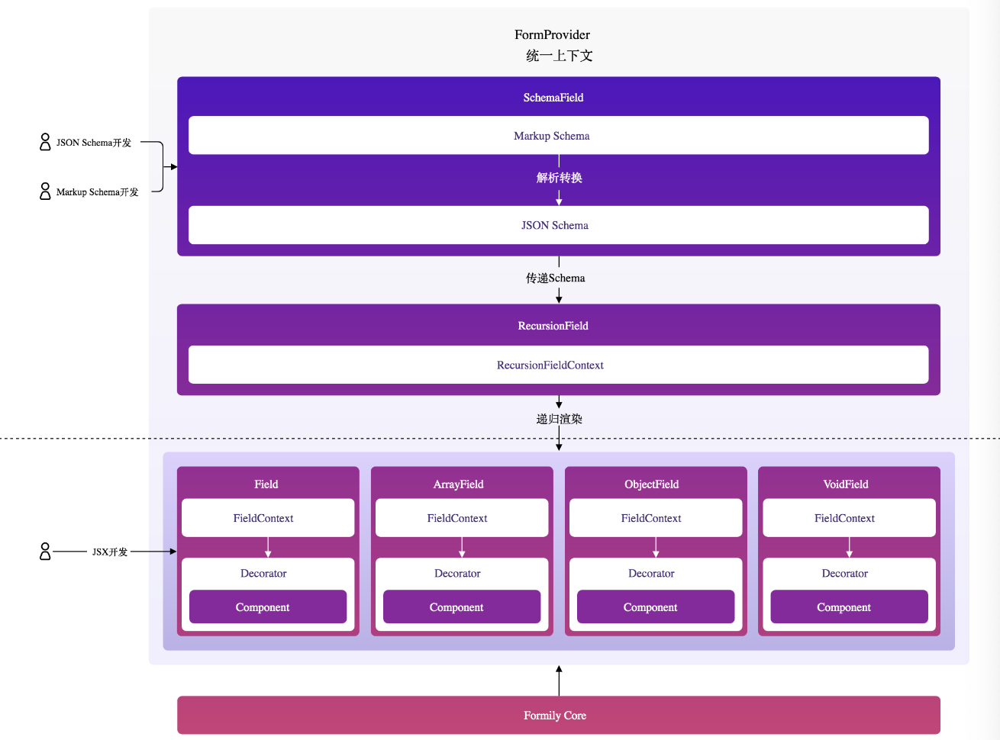

# reactive 插件库

- 抽象表单数据、使用发布订阅模式更新数据

  - 统一管理&&监听表单数据
  - 监听 get、收集依赖
  - 监听 set、发布时间、更新 state

- 缺点
  - 只针对表单数据管理，缺少对表单的复杂场景的管控
    - 缺少表单业务场景的生命周期（初始化、更新、销毁）
    - 没有抽取表单属性（title，Component，errors，visible，onInput）
    - 难以管理表单字段联动
    - 表单的校验方式也没有抽取
    - ...

# react-core 插件库

- reactive 是 数据监听管理、mobx 的一种性能优化版本
- 那么 core 库的定位是 MVVM 中的 ViewModel 层，它是针对表单这个特定的领域

  - 创建的一个通用的 Observable 对象，ViewModel 里面包含了业务需要用到的所有渲染数据，例如表单中的 component，decorator，validator，feedback 等等。然后将这些数据包装起来放在一个 observable，提供外部接口来访问这些数据，View 层直接读取这个 ViewModel 的数据来渲染。（在 core 库中，这个大 observable 数据可以通过 form.getFormGraph 方法来获取）

  - ViewModel 提供
    - 生命周期
    - 虚拟属性访问 （实际是 get 与 set 方法）
    - 虚拟设置与获取（setValuesIn，getValuesIn
    - 提供公开调用的方法（onInput，onFocus，onBlur）

# formily-react 

- 目前我们了解、以后的formily 插件库有
    - reactive,抽象表单数据、高性能管理表单
    - core,类似于高度抽取表单业务场景、封装公共方法
        - 生命周期、校验方法、属性方法、方法调用
- reactive 与 core 是formily 发动机，是完全与 UI 脱离的，达到了完美的 表单store 管理
  但是在业务中接入使用core和reactive，会发现
    - Field组件重复，每次自定义UI都需要用到
    - Context组件重复，总是需要建立Form与Field的Context，这点也麻烦
    - 自定义UI组件暂时无法实现嵌套的组件，例如一个ObjectField组件下面优雅地嵌入一个Field组件

- formily-react 是根据react语言环境下封装的UI
  

    Formily的React库原理
    - 通过 FormProvider 统一上下文、作为 UI层和core层的桥接器、获取 core 层的数据
    - 用户 开发表单UI、定义 SchemaField（JSON | Markup )
    - 解析转换为 JSON、传递Schema 到 RecursionField
    - 通过RecursionFieldContext 递归渲染 Field UI （Field、ArrayField...）
    